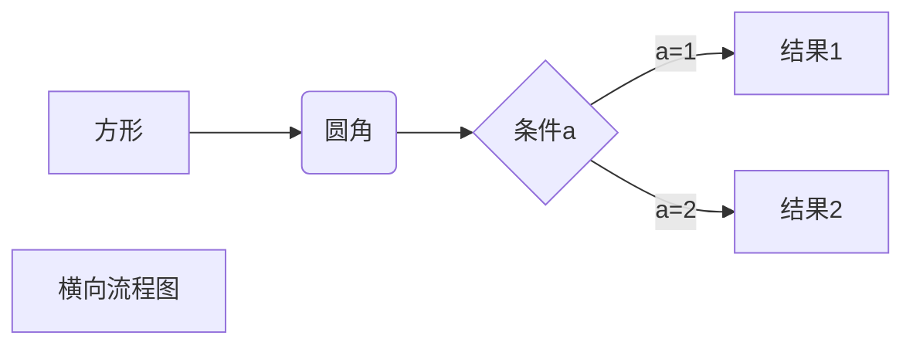

# **testRestfuApi----测试用项目工程**
源码[点这里](https://github.com/amix521)
>本说明语法参考<https://www.runoob.com/markdown/md-link.html>
---
>* ### **使用maven构建、springboot+mybatis框架[^m3]**
#### 1. *为方便代码及简洁，引入了lombok[^m1]，可以使用@Slf4j注解直接使用log来打印日志，可以使用@Getter @Setter注解来代替get、set方法*
#### 2. *为方便测试接口，引入swagger，在对应接口上添加接口说明及参数说明即可生成对应的页面来测试，需要配置加载及对应的页面资源跨域。
#### 3. *为方便vo、dto、po[^m2]的相互转化，引入dozer，需要在springboot配置文件做相应的配置来读取相互转换的配置文件。*
#### 4. *数据库使用的mysql，需要再springboot配置文件spring节点下配置datasource*


---
>* ### **该项目主要包含了以下相关测试内容**
#### 1. *一个live2d.html对应的接口*
#### 2. *restful接口规范练习UserController*
#### 3. *swagger使用范例*
#### 4. *vo-dto的使用范例UserController.update*
#### 5. *dozer的使用范例UserController.update*
#### 6. *websocket的简单demo[^5]*
#### 7. *基于websocket的stomp的简单demo[^m4]*
#### 8. *自定义注解，target包下*
#### 9. *关于自定义注解的延伸使用aop横切,MyLog*
#### 10. *关于自定义注解的延伸使用登录验证，通过拦截器LoginInterceptor[^m6]内获取注解标签来做业务处理*

>※福利markdown画流程图↓※


```flow
st=>start: 开始框
op=>operation: 处理框
cond=>condition: 判断框(是或否?)
sub1=>subroutine: 子流程
io=>inputoutput: 输入输出框
e=>end: 结束框
st->op->cond
cond(yes)->io->e
cond(no)->sub1(right)->op
```

```sequence
对象A->对象B: 对象B你好吗?（请求）
Note right of 对象B: 对象B的描述
Note left of 对象A: 对象A的描述(提示)
对象B-->对象A: 我很好(响应)
对象A->对象B: 你真的好吗？
```
>※福利画流程图↑※

[^m1]:因为eclipse不支持该插件，所以要用特殊方法引入
[^m2]:vo对应展示层，dto对应服务层，po对应固话层
[^m3]:需要在springboot配置文件加入对应配置
[^m4]:STOMP(Simple Text-Orientated Messaging Protocol) 面向消息的简单文本协议。
WebSocket是一个消息架构，不强制使用任何特定的消息协议，它依赖于应用层解释消息的含义；与处在应用层的HTTP不同，WebSocket处在TCP上非常薄的一层，会将字节流转换为文本/二进制消息，因此，对于实际应用来说，WebSocket的通信形式层级过低，因此，可以在 WebSocket 之上使用 STOMP协议，来为浏览器 和 server间的 通信增加适当的消息语义。
如何理解 STOMP 与 WebSocket 的关系：<https://blog.csdn.net/m0_37542889/article/details/83750665>
HTTP协议解决了 web 浏览器发起请求以及 web 服务器响应请求的细节，假设 HTTP 协议 并不存在，只能使用 TCP 套接字来 编写 web 应用，你可能认为这是一件疯狂的事情；
直接使用 WebSocket（SockJS） 就很类似于 使用 TCP 套接字来编写 web 应用，因为没有高层协议，就需要我们定义应用间所发送消息的语义，还需要确保连接的两端都能遵循这些语义；
同 HTTP 在 TCP 套接字上添加请求-响应模型层一样，STOMP 在 WebSocket 之上提供了一个基于帧的线路格式层，用来定义消息语义。
[^5]:websocket需要配置加载来初始化类ServerEndpointExporter
[^m6]:需要再TestWebConfig配置时引入拦截器[^m7]
[^m7]: ```
    @Override
	 public void addInterceptors(InterceptorRegistry registry) {
       // 通过配置加入拦截器,拦截请求为所有请求
       registry.addInterceptor(LoginInterceptor()).addPathPatterns("/**");
       registry.addInterceptor(AuthorityInterceptor()).addPathPatterns("/**");
	 }```

